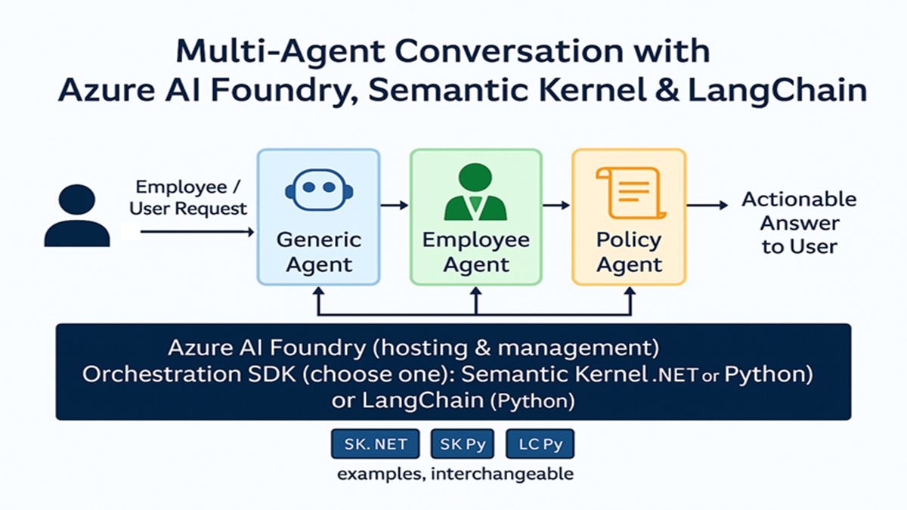

# Azure Multi-Agent Workshop

Build sophisticated Azure OpenAI agent applications using three aligned backends:
1. **Python + LangChain**
2. **Python + Semantic Kernel**
3. **.NET + Semantic Kernel**

Pick your stack, follow the dedicated README, and connect the shared React frontend to try multi-agent routing, group chat, and Azure AI Foundry integrations.

## 📚 Documentation

- **[🚀 Installation Checklist](docs/INSTALL.md)** – Tools you need before running anything
- **[☁️ Azure AI Services Setup](docs/AI_SERVICES_GUIDE.md)** – Provision Azure OpenAI + Foundry resources
- **[🐍 Python LangChain](Backend/python/langchain/README.md)** – LangChain backend guide
- **[🐍 Python Semantic Kernel](Backend/python/sk/README.md)** – Semantic Kernel (Python) guide
- **[🔷 .NET Semantic Kernel](Backend/dotnet/sk/README.md)** – Semantic Kernel (.NET) guide
- **[👥 Group Chat Guide](docs/GROUP_CHAT.md)** – Multi-agent collaboration patterns

## 🚀 Quick Start

Choose your preferred platform and follow the specific setup guide:

### 🐍 **Python - LangChain**
```bash
cd Backend/python/langchain
# Follow setup in README.md
```
**Framework**: LangChain  
**Port**: 8000  
📚 **[Complete LangChain Setup Guide →](Backend/python/langchain/README.md)**

### 🐍 **Python - Semantic Kernel**
```bash
cd Backend/python/sk
# Follow setup in README.md  
```
**Framework**: Semantic Kernel  
**Port**: 8000  
📚 **[Complete Python SK Setup Guide →](Backend/python/sk/README.md)**

### 🔷 **.NET - Semantic Kernel**  
```bash
cd Backend/dotnet/sk
# Follow setup in README.md
```
**Framework**: Semantic Kernel  
**Port**: 8000  
📚 **[Complete .NET Setup Guide →](Backend/dotnet/sk/README.md)**

### 🌐 **Frontend** (All Platforms)
```bash
cd frontend
npm install && npm start
# Runs on http://localhost:3001
# Connects to backend on port 8000
```
📚 **[Frontend Documentation →](frontend/PROFESSIONAL_UI_README.md)**

## 📋 Prerequisites

- **Azure Account** with Azure OpenAI Service access
- **Azure AI Services Setup** (Required): **[Complete Azure Setup Guide →](docs/AI_SERVICES_GUIDE.md)**
- **Platform-specific requirements**: See platform README for details
- **Optional**: Azure AI Foundry for enterprise features

> **⚠️ Azure Services Required**: You must have Azure AI services set up to run this workshop. If you encounter issues during setup, you can optionally use the shared `.env` file provided during the workshop instructions.

## 🏗️ Workshop Architecture

This workshop demonstrates modern multi-agent patterns:



- **🤖 Multi-Agent Systems**: Collaborative AI conversations
- **🔄 Agent Routing**: Intelligent request distribution  
- **💬 Group Chat**: Multi-participant AI discussions
- **🌐 Modern Frontend**: Professional React interface
- **📊 Session Management**: Persistent conversation state
- **🔐 Enterprise Ready**: Azure authentication & security

## 📚 Documentation (Quick Links)

- **[🐍 Python LangChain](Backend/python/langchain/README.md)** – Complete LangChain guide
- **[🐍 Python Semantic Kernel](Backend/python/sk/README.md)** – Complete Python SK guide  
- **[🔷 .NET Semantic Kernel](Backend/dotnet/sk/README.md)** – Complete .NET guide
- **[⚙️ Environment Guide](docs/ENVIRONMENT_GUIDE.md)** – Detailed Azure configuration references
- **[👥 Group Chat Guide](docs/GROUP_CHAT.md)** – Multi-agent orchestration walkthrough
- **[🚀 Installation Checklist](docs/INSTALL.md)** – Validate your local toolchain

## 🎯 Learning Path

1. **Choose Platform**: LangChain, Python SK, or .NET SK (see specific READMEs)
2. **Follow Setup**: Platform-specific installation guides
3. **Configure Azure**: Environment and credentials setup  
4. **Run Application**: Start your chosen implementation on port 8000
5. **Run Frontend**: Start React frontend on port 3001  
6. **Run Examples**: Interactive notebooks and demos
7. **Build Custom**: Extend with your own agents

**💡 Note**: All backend implementations run on port 8000. The frontend (port 3001) connects to whichever backend you choose to run.

---

**🚀 Ready to start?** Pick your platform above and follow the specific setup guide!